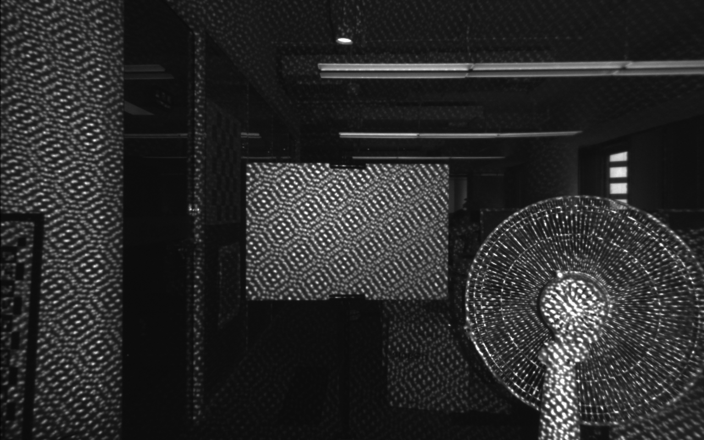

# Semi-Global Matching on the GPU

This is the implementation of [Embedded real-time stereo estimation via Semi-Global Matching on the GPU](http://www.sciencedirect.com/science/article/pii/S1877050916306561), [D. Hernandez-Juarez](http://www.cvc.uab.es/people/dhernandez/) et al, ICCS 2016. Then rebuild to provide p1 p2 for every pixel points with a pointer.

Results for example image (left and right Images):




Results for example image (Output):


## How to compile and test

Simply use CMake and target the output directory as "build". In command line this would be (from the project root folder):

```
mkdir build
cd build
cmake ..
make
```

## How to use it

Type: `./sgm`

## Related Publications

[Embedded real-time stereo estimation via Semi-Global Matching on the GPU](http://www.sciencedirect.com/science/article/pii/S1877050916306561)
[D. Hernandez-Juarez](http://www.cvc.uab.es/people/dhernandez/), A. Chacón, A. Espinosa, D. Vázquez, J. C. Moure, and A. M. López
ICCS2016 – International Conference on Computational Science 2016

## Requirements

- OpenCV
- CUDA
- CMake

## Limitations

- Maximum disparity has to be 128
- PATH_AGGREGATION parameter must be set to 4 or 8
- Image width and height must be a divisible by 4

